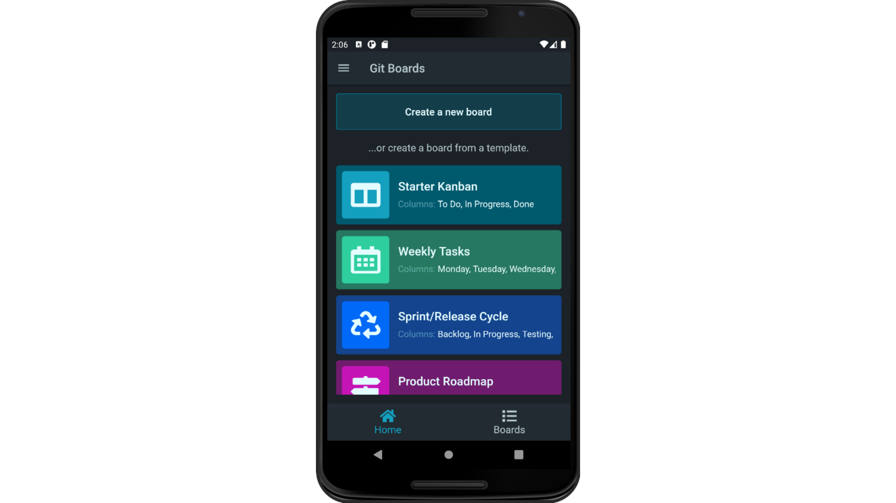

<h1 align="center">Kanban Boards</h1>

<p align="center">


</p>

## About The Project

_The application allows you to track and visualize your workflow using boards. 
By moving the cards that correspond to specific tasks, we can better visualize the workflow and quickly find processes that accumulate and become bottlenecks. 
The application allows you to create an empty board, or you can choose one of five templates. 
I built the server in the .Net Core framework and hosted it on the Azure platform. 
On the other hand, the client part was created in the Flutter framework, and I used the Bloc library to manage its state._

<br/>

<p align="center">
  
</p>

## Features

- Auth system
- Five starting boards
- Creating and managing boards, columns, and cards

## Built With

| Server                                                                                                           | Client                                                                                                           |
| ---------------------------------------------------------------------------------------------------------------- | ---------------------------------------------------------------------------------------------------------------- |
| [.NET Core](https://docs.microsoft.com/en-us/dotnet/) 3.1.0                                                      | [Dart](https://dart.dev/guides)                                    |
| [ASP.NET Web API](https://docs.microsoft.com/en-us/aspnet/core/web-api/?view=aspnetcore-3.1)                     | [Flutter](https://flutter.dev/docs)                                                                       |
| [Entity Framework](https://docs.microsoft.com/en-us/ef/)                                                         | [Bloc](https://bloclibrary.dev/#/) |
| [MediatR](https://github.com/jbogard/MediatR/wiki)                                                               |
| [Fluent Validation](https://fluentvalidation.net/)                                                               |
| [Swagger](https://swagger.io/)                                                                                   |

## Getting Started

### Prerequisites

- Flutter and Dart SDK
- .NET Core 3.1.0
- SQL Server

### Installation

1. **In solution WebUI in `appsettings.json` set your database connection string.**

```json
"ConnectionStrings": {
    "EFKanbanData": "ENTER YOUR CONNECTION STRING"
  },
```

2. **Build and run the solution.**

3. **Open iOS or Android emulator.**

4. **In the `main.dart` file select the environment (development or production).**

```dart
Future<void> main() async {
  setEnvironment(Environment.Production);
}
```

5. **For development environment run the following command in the root of the repository.**
   
```shell
adb reverse tcp:5001 tcp:5001
```

6. **Start app by running flutter run.**

```shell
flutter run
```

## License

This project is licensed under the MIT License.

## Contact

**Krzysztof Talar** - [Linkedin](https://www.linkedin.com/in/ktalar/) - krzysztoftalar@protonmail.com
